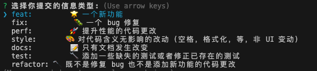
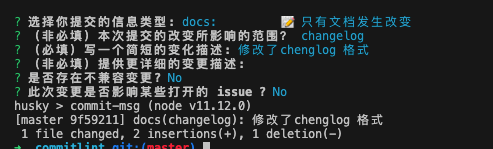

## Git commit 规范

结合 `commitizen` `commitlint` `conventional-changelog-cli` `husky`，进行封装，一键安装，开箱即用的 `git commit` 规范。

### 功能

1. 自动检测 commit 是否规范，不规范不允许提交
2. 自动提示 commit 填写格式。不怕忘记规范怎么写
3. 集成 git add . && git commit 不需要在执行两个命令
4. 自动生成 changelog


## 使用

1. 代码提交 npm run cz



2. 选择一个类型会自动询问

    1. (非必填）本次提交的改变所影响的范围
    2. (必填）写一个简短的变化描述
    3. (非必填）提供更详细的变更描述
    4. (非必填)是否存在不兼容变更?
    5. (非必填)此次变更是否影响某些打开的 issue 



### 效果演示


### 配置

1. 如果您是 vue-cli3 的项目可以直接使用即可

```bash
vue add commitlint
```

2. 如果您不是 vue-cli3 的项目

```bash
npm i vue-cli-plugin-commitlint commitizen commitlint conventional-changelog-cli husky -D
```

- 在 package.json 中添加

```json
{
  "scripts": {
    "log": "conventional-changelog --config ./node_modules/vue-cli-plugin-commitlint/lib/log -i CHANGELOG.md -s -r 0",
    "cz": "npm run log && git add . && git cz"
  },
  "husky": {
    "hooks": {
      "commit-msg": "commitlint -E HUSKY_GIT_PARAMS"
    }
  },
  "config": {
    "commitizen": {
      "path": "./node_modules/vue-cli-plugin-commitlint/lib/cz"
    }
  }
}
```

增加 commitlint.config.js 文件

```js
module.exports = {
  extends: ['./node_modules/vue-cli-plugin-commitlint/lib/lint']
};
```

## 使用

```bash
npm run cz  # git add . && git commit -m 'feat:(xxx): xxx'
npm run log # 生成 CHANGELOG
```

### 规则

| 规范名   | 描述                                                    |
| -------- | ------------------------------------------------------- |
| docs     | 仅仅修改了文档，比如 README, CHANGELOG, CONTRIBUTE 等等 |
| chore    | 改变构建流程、或者增加依赖库、工具等                    |
| feat     | 新增 feature                                            |
| fix      | 修复 bug                                                |
| merge    | 合并分之                                                |
| perf     | 优化相关，比如提升性能、体验                            |
| refactor | 代码重构，没有加新功能或者修复 bug                      |
| revert   | 回滚到上一个版本                                        |
| style    | 仅仅修改了空格、格式缩进、都好等等，不改变代码逻辑      |
| test     | 测试用例，包括单元测试、集成测试等                      |
